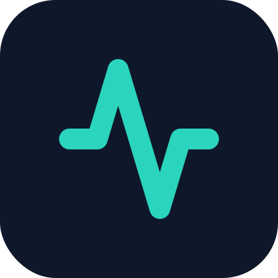
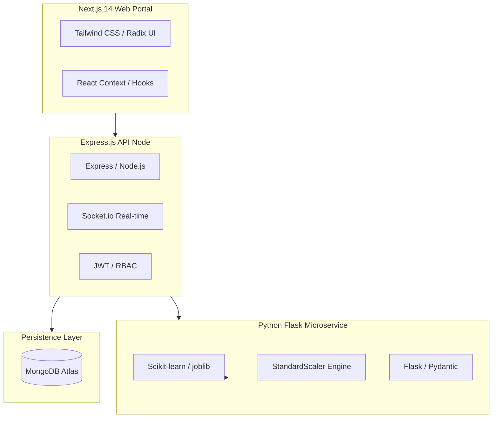

<p align="center">
  
</p>

<h1 align="center">CliniqueAI</h1>

<p align="center">
  <strong>Next-Gen Clinical Intelligence — Bridging the gap between patient data and predictive care.</strong>
</p>

<p align="center">
  
  
  
  
  
</p>

---

CliniqueAI is a state-of-the-art SaaS platform designed to bridge the gap between clinical data and predictive diagnostics. By utilizing advanced machine learning and real-time messaging, CliniqueAI empowers doctors with predictive risk assessments and patients with a streamlined care experience.

---

## ✨ Key Features

- **🛡️ Clinical AI Engine**: Real-time diabetes risk prediction utilizing multi-factor clinical biomarkers.
- **📊 Doctor Dashboard**: High-fidelity interface for patient registry management and predictive health analytics.
- **📨 Pro-Messaging Hub**: Real-time clinical messaging system powered by Socket.io with WhatsApp-grade UX.
- **📜 Hospital-Grade Reports**: One-click generation of professional clinical reports (PDF) with institutional branding.
- **🏥 Patient Portal**: Dedicated space for patients to view clinical insights and communicate with their care team.
- **🆘 Integrated Help Hub**: Premium support center with a searchable knowledge base and documentation center.

---

## 🏗️ Technical Architecture



---

## 🛠️ Tech Stack

### Frontend
- **Next.js 14** (App Router)
- **Tailwind CSS** (Styling)
- **Framer Motion** (Animations)
- **Lucide React** (Icons)
- **Socket.io-client** (Messaging)

### Backend
- **Node.js & Express**
- **MongoDB & Mongoose** (ORM)
- **Socket.io** (Real-time Communication)
- **JWT** (Security)

### AI Microservice
- **Python 3.x**
- **Flask** (API)
- **Scikit-learn** (Predictive Modeling)
- **Waitress** (WSGI Server)

---

## ⚙️ Environment Configuration

To run this project, you will need to add the following environment variables to your `.env` files in each service directory.

### AI Service (`Ai/.env`)
- `GROQ_API_KEY`: Your Groq Cloud API Key for clinical reasoning.

### Backend (`backend/.env`)
- `MONGO_URI`: MongoDB Atlas connection string.
- `JWT_SECRET`: Secure string for token signing.
- `CLIENT_URL`: Frontend deployment URL (for CORS).
- `EMAIL_USER` & `EMAIL_PASS`: SMTP credentials (e.g., Brevo or Gmail) for notifications.
- `CLOUDINARY_CLOUD_NAME`, `CLOUDINARY_API_KEY`, `CLOUDINARY_API_SECRET`: For clinical image storage.
- `TWILIO_ACCOUNT_SID`, `TWILIO_AUTH_TOKEN`: For WhatsApp/SMS care updates.
- `GOOGLE_CLIENT_ID`: For One-Tap authentication.

### Frontend (`frontend/.env.local`)
- `NEXT_PUBLIC_API_URL`: URL of your Node backend (e.g., `http://localhost:5000/api`).
- `NEXT_PUBLIC_GOOGLE_CLIENT_ID`: Same as backend Google ID.
- `NEXT_PUBLIC_FIREBASE_API_KEY`: (Optional) For push notifications and analytics.

---

## 🚀 Getting Started

### 1. Clone the Repository
```bash
git clone https://github.com/soham04010/CliniqueAI.git
cd CliniqueAI
```

### 2. Setup AI Service
```bash
cd Ai
python -m venv venv
source venv/bin/activate  # venv\Scripts\activate on Windows
pip install -r requirements.txt
python app.py
```

### 3. Setup Backend
```bash
cd ../backend
npm install
npm run dev
```

### 4. Setup Frontend
```bash
cd ../frontend
npm install
npm run dev
```

---

## 👨‍💻 Authors

- **Prem Patel** ([prempatel-ai](https://github.com/prempatel-ai)) - Lead Implementation & Clinical Architecture.
- **Soham Chaudhary** ([soham04010](https://github.com/soham04010)) - Frontend Architecture & Backend Orchestration.

---

## 📄 License

This project is licensed under the MIT License - see the [LICENSE](LICENSE) file for details.

---

<p align="center">Built with ❤️ by Prem & Soham for the future of clinical technology.</p>
